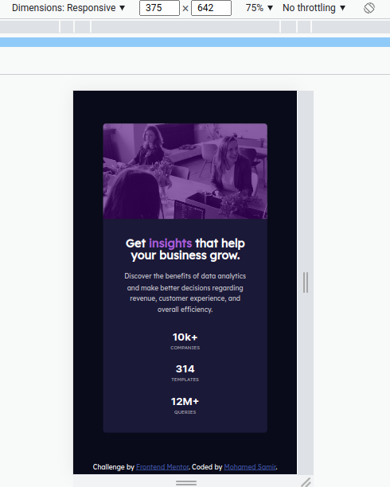

# Frontend Mentor - Stats preview card component solution

This is a solution to the [Stats preview card component challenge on Frontend Mentor](https://www.frontendmentor.io/challenges/stats-preview-card-component-8JqbgoU62). Frontend Mentor challenges help you improve your coding skills by building realistic projects.

## Table of contents

- [Overview](#overview)
  - [The challenge](#the-challenge)
  - [Screenshot](#screenshot)
  - [Links](#links)
- [My process](#my-process)
  - [Built with](#built-with)
  - [What I learned](#what-i-learned)
  - [Continued development](#continued-development)
  - [Useful resources](#useful-resources)
- [Author](#author)
- [Acknowledgments](#acknowledgments)

## Overview

### The challenge

Users should be able to:

- View the optimal layout depending on their device's screen size

### Screenshot

**Desktop**

**Mobile**

### Links

- Solution URL: [Add solution URL here](https://your-solution-url.com)
- Live Site URL: [Add live site URL here](https://your-live-site-url.com)

## My process

### Built with

- Semantic HTML5 markup
- CSS custom properties
- Flexbox
- CSS Grid
- Desktop-first workflow

### What I learned

i learned how to use css grid it saves lots of effort when it comes to mobile responsiveness.

### Continued development

I'll try to use css grid more often in the next challenges

### Useful resources

- [omnifood](https://omnifood-mohamed.netlify.app/) - This helped me make overlay on the background image using `linear-gradient` property

## Author

- LinkedIn - [Mohamed Samir](https://www.linkedin.com/in/mohamad-samir08/)
- Frontend Mentor - [@mohamed-sameer](https://www.frontendmentor.io/profile/mohamed-sameer)

**Note: Delete this note and add/remove/edit lines above based on what links you'd like to share.**

## Acknowledgments

Thanks for [frontendmentor](https://www.frontendmentor.io) for providing these challenges.
